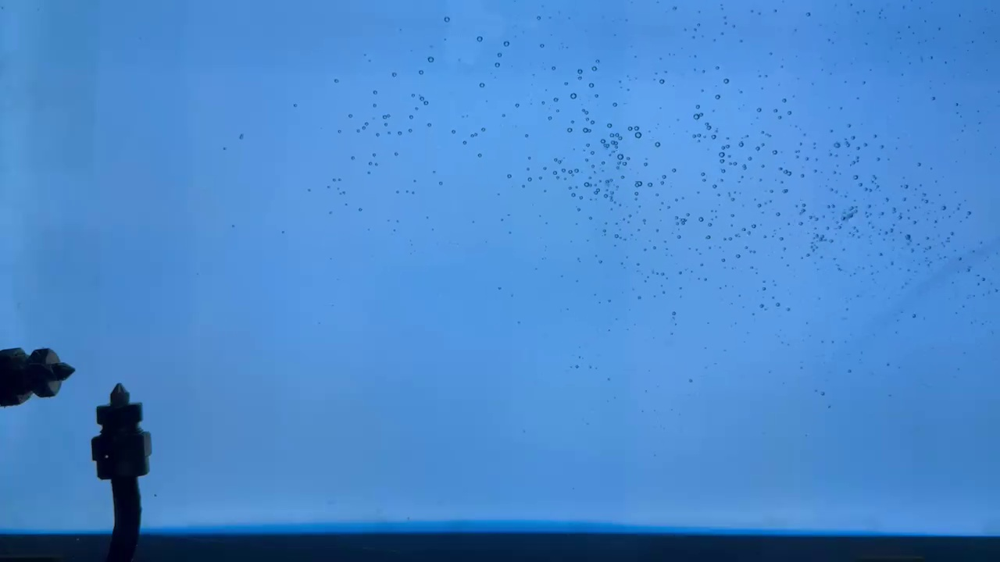
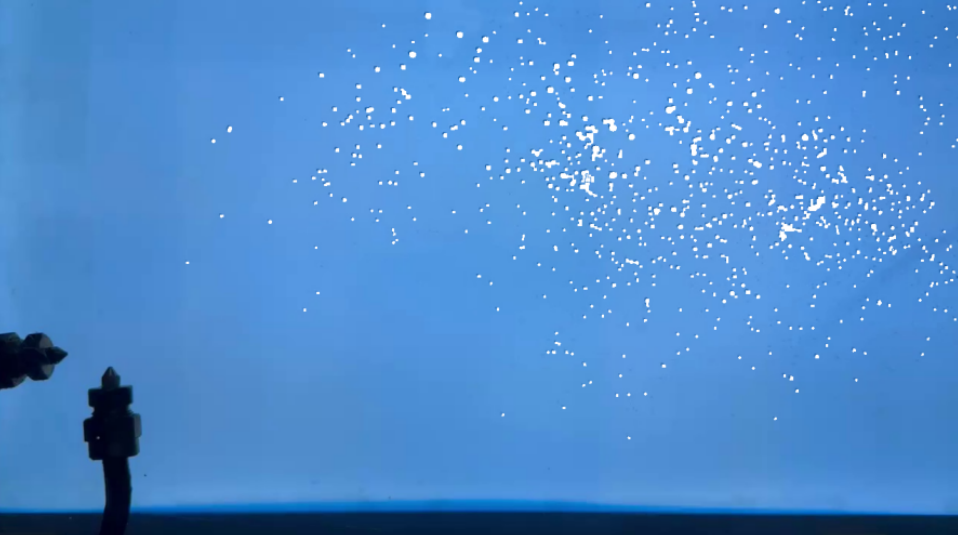
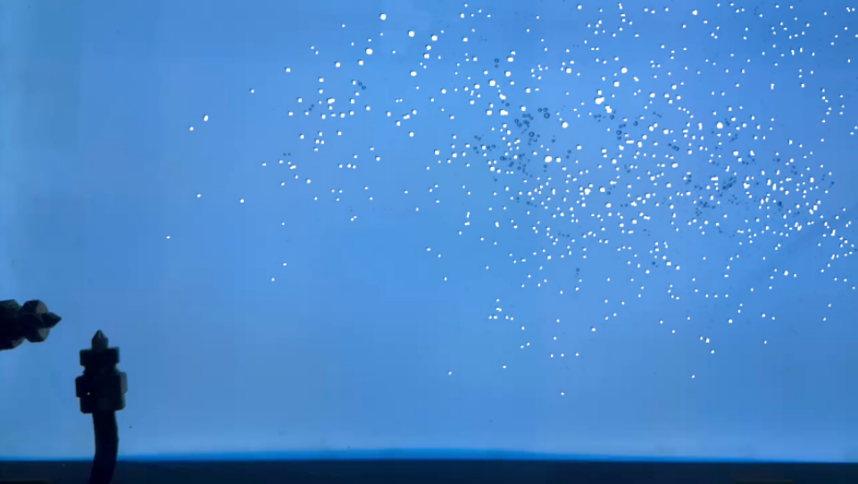
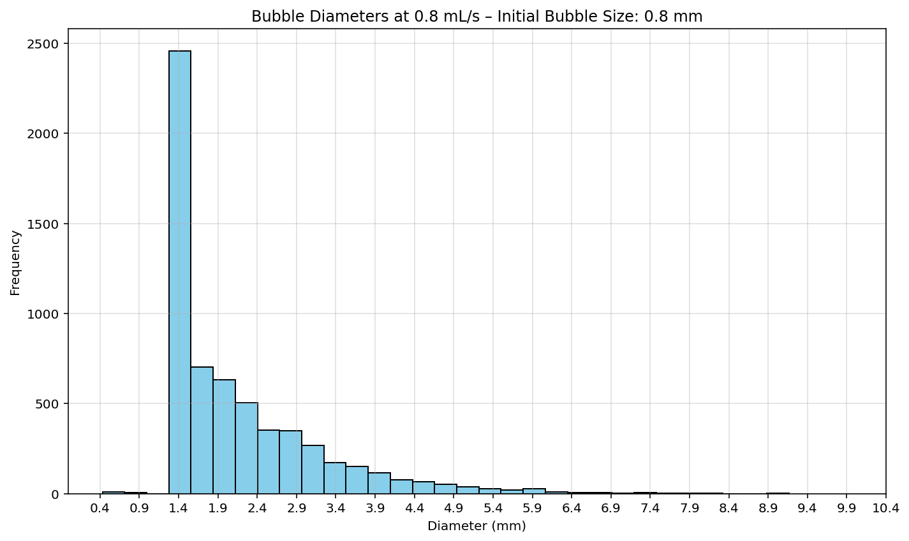

# Bubble Detection Using Image Processing Techniques

The aim of this code is to identify bubbles that have been sheared by a mechanical dispersant, where bubble recognition is necessary to evaluate the efficiency of the dispersant.  
However, the workflow implemented in this code is general and can be applied to bubble detection in a wide range of cases, whether for industrial applications or academic studies.

---

## Raw Image
Original image extracted from the experiment:

---

## Output Image (Bubbles Recognized)
Image showing the bubbles identified after processing:

---

## Filtered Image
Image highlighting the bubbles after applying filtering and cleaning techniques:

---

## Histogram
Histogram of the detected bubble diameters:

---

## Project Structure
- `/Scripts`: Python scripts for bubble detection and analysis.
- `/Dataset`: Raw experimental images and datasets.
- `/Outputs`: Results from the processing, such as recognized bubbles, filtered images, and histograms.

